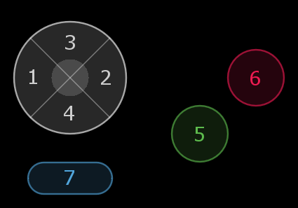

LIKO-12 has got 2 players controllers, each with 7 buttons:



---

### Default Controllers Keysmap:

* **Player 1**: Left,Right,Up,Down, Z,X, C.
* **Player 2**: S,F,E,D, Tab,Q, W.

**Note**: The keymap can be changed by the user via the `keymap` program.

---

Checks if a gamepad button has been pressed right now.

When the button is held for a little bit longer, this function will return true, check `isrepeat` return value.

---

#### Syntax:
```lua
bool, isrepeat = btnp(id,p)
```

---

#### Arguments:

* **<id/> (Number)**: The button number to check, [1,7].
* **[p] (Number) (1)**: The player number, 1 or 2.

---

#### Returns:

* **bool (Boolean)**: True if the gamepad button is down, false if not.
* **isrepeat (Boolean)**: True if this function is returning true after holding the button for 2 seconds.