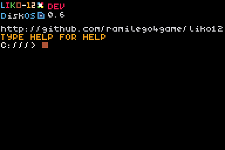

# Welcome to the official LIKO-12 Documentation !

**Please note that the documentation is not finished and it's still being written !**

---

## About:

---

LIKO-12 is an _open source_ **fantasy computer** completely written in the Lua programming language where you can make, play and share tiny retro-looking games and programs.

The LIKO-12 fantasy computer comes with a default, fully customizable, DOS-like operating system installed, called DiskOS, which provides an environment with basic command line programs and visual game editors.

Games are stored as disk files that can be saved, shared and uploaded to pastebin via the built-in program.

---

## Specifications:

---

| Spec  | Info                                |
| ----- | ----------------------------------- |
| CPU   | LuaJIT (Lua 5.1)                    |
| GPU   | 192x128 4-Bit Screen                |
| Map   | 144x128 Cell (255 Tile)             |
| HDD   | 2x 25mb drives                      |
| Input | Keyboard, Mouse, Touch, and Gamepad |

---

## Social links:

---

| Type           | Link                                                      |
| -------------- | --------------------------------------------------------- |
| Itch.io        | [LIKO-12](https://ramilego4game.itch.io/liko12)           |
| Twitter        | [@RamiLego4Game](https://twitter.com/ramilego4game)       |
| Discord (Chat) | [Fantasy Consoles Server](https://discord.gg/H48rBJy)     |
| Trello Board   | [LIKO-12](https://trello.com/b/bHo8Y9sx/liko-12)          |
| Github         | [LIKO-12](https://github.com/RamiLego4Game/LIKO-12)       |
| Email          | [ramilego4game@gmail.com](emailto:ramilego4game@gmail.com)|

---

## Guides:

---

* [Installation Guide](Installation Guide.md)
* [Getting Started](Getting Started.md)
* [Using external code editor](Using external code editor.md)