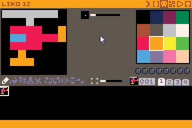
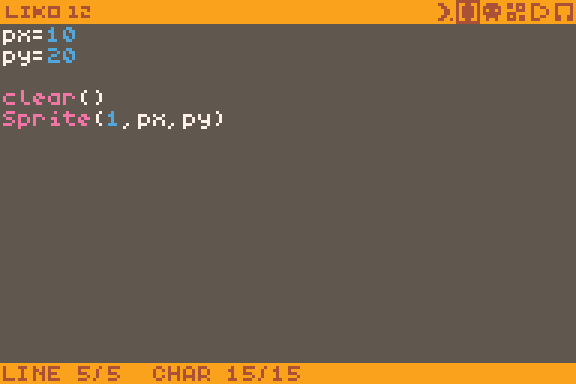
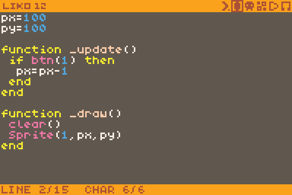
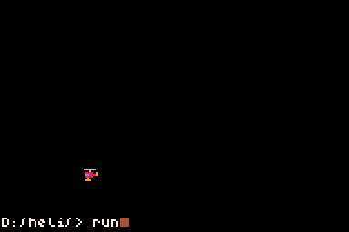
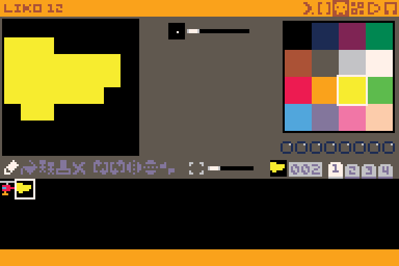
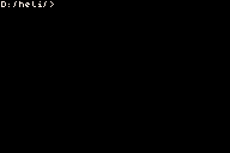
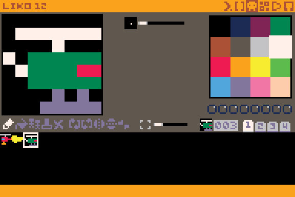
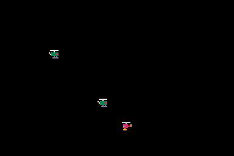

# tutorial: your first game in lua/liko-12

from 0 to an arena shooter,
no prerequisite necessary

## step 0 : draw player in sprite editor

press esc, back on android , to open editors and click on the tile editor:
paint youself a nice simple player sprite


## step 1: display your sprite 

navigate to the code editor and type

```
clear()
Sprite(1,0,0)
```

to clear console and display player
press esc/back to go to prompt and type
`run`

result:


you will notice that the draw operation is executed one time,
then you are returned to the prompt 

## step 2: variables 

to store player state, we need to define variables
to be able to access it from everywhere in the program

open the code editor and add 

```
px=0
py=0
```



go to the prompt and type `run` :


 
## step 3 : moving your display code to the _draw() function

the `_draw()` function is called whenever LIKO 12 draws the screen,
you don't need to call it yourself

up to this point our script was executed just one time ( clear the screen, display the player )
in the context of an arcade game to move everything fluidly , you the program never stops running,
_draw() is called up to 60 times a second

update your code snippet like such

```
px=0
py=0

function _draw()
 clear()
 Sprite(1,px,py)
end
```
 
 
if you type esc and run it, the result will be the same, but you will not be returned to the prompt,
only if you type esc you will interrupt the program !


 
## step 4 : the _update() function and btn()

you will most probably always run your game logic in the `_update()` function,
liko calls it normally 60 times by second

this is where you would check for button/screen presses and change the player coordinates,
move the baddies.....

we will use the `btn()` function to check if arrows are pressed and change the player coordinates,
that are stored in 
`px
py`
we will use an ` if then end ` statement to do something when the button is pressed


create an update function with the following code :
```
_update()
 if btn(1) then --checking if left is pressed
  px=px-1 -- this block is executed if the condition is met
 end
end
```



if you `run` your cartridge from the prompt,
you will see you can move your player smoothly wih arrow keys



## step 5: fire , arbitrary amout of bullets

let us declare a table to put all the bullets we will fire
```
bullets={}
```


we will declare a function to call when we need to create one,
it will add it to our "bullets" table
```
function createbullet(bx,by)
 b={}
 b.x=bx
 b.y=by
 table.insert(bullets,b)
end
```

add this in ```_update()``` to actually add bullets !!
```
if btn(6) then
 createbullet(px,py)
end
```

now we need to display them , add this in ```_draw() ```
```
for i,b in ipairs(bullets)
do
 Sprite(2,b.x,b.y)
end
```


by adding this function in ```_update()``` 
all bullets will be moved
```
function movebullets()
 for i,b in ipairs(bullets)
 do
  b.x=b.x+1
 end
end
```

by really pushing it you should notice that it starts to slow down after a while :
at the moment, we do not remove bullets that go off screen so the ```bullets``` table 
just keeps getting bigger and bigger !!!
modify move bullets :
```
function movebullets()
 for i,b in ipairs(bullets)
 do
  b.x=b.x+1
  if b.x>160 then
   table.remove(bullets,i)
  end
 end
end
```

note that when using remove, you actually pass the index of the thing you want to remove in the table !
know you should see bullets disappearing before reaching the end of the screen

add a call to ```movebaddies()``` in ```_update()```

do not forget to draw a nice bullet on the second image ( 002 )



here is the resulting listing 


here is what should happen when you press a fire button




## step 6: ennemies , working on a list of unkown size

we will add ennemies to a table,
so that we can have an unspecified amout depending on the level

first go and draw a nice ennemy in picture 3:



let us declare a table to store ennemies:
```
ennemies = {}
```

then we will write a function to abstract the task of adding an ennemy 
```
function addennemy(ex,ey)
 ennemy={}
 ennemy.x=ex
 ennemy.y=ey
 table.insert(ennemies,ennemy)
end
```

lets add ennemies right after in the global context (before update )
```
--to test
addennemy(40,40)
addennemy(80,80)
```

append this to ```draw()``` to display ennemies 
```
for i,e in ipairs(ennemies)
do
 Sprite(3,e.x,e.y)
end
```


this is the result you should have, starting to look like a game !!!!



## step 7 : bullet collision
## step 8: player colliding with ennemies

## step 9: victory condition, function pointers in _update() and _draw() !
