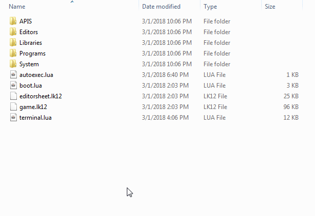

LIKO-12 Uses LÖVE Frawework, and so creating games binaries take the same steps.

First of all, we have to create a modified .love file, which is actually a .zip file, but with a different extenstion.

---

## 1- Start by downloading the LIKO-12_Universal.love build, from either itch.io or github


## 2- Rename it from `.love` to `.zip` (In windows you will have to enable file extensions view, follow [this article](https://www.howtohaven.com/system/show-file-extensions-in-windows-explorer.shtml)).

---


---

## 3- Extract the `.zip`

---


---

## 4- Delete some unnecessary files

  * `/Peripherals/WEB`
  * `/Engine/luajit-request`
  * `/OS/DiskOS`
  * `/OS/PoorOS`

## 5- Create `build.json`, with the following content, replace the values with your game name

```json
{
  "Title": "LIKO-12 - Snake",
  "Appdata": "liko12_ramilego4game_snake"
}
```

## 6- Replace `game.lk12` in `/OS/GameDiskOS/game.lk12` with your game file

---



---

## 7- Archive everything again

---


---

## 8- Change the extension back to `.love`

---


---

## 9- Now you may want to create Windows, Linux and Mac builds, if so, follow the classical LÖVE Instructions

  [LÖVE Wiki -> Game Distribution](https://love2d.org/wiki/Game_Distribution)

## 10- Enjoy !