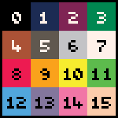

# GPU.color
---

Set's the current active color.

---



---

* **Available since:** _GPU:_ v1.0.0, _LIKO-12_: v0.6.0
* **Last updated in:** _GPU:_ v1.0.0, _LIKO-12_: v0.6.0

---

**Usages:**

---

# 1. Set the current active color:
---

```lua
GPU.color(id)
```


---
#### Arguments
---

* **id (number):** The new active color id (0-15).

---

# 2. Get the current active color:
---

```lua
local id = GPU.color()
```


---
#### Returns
---

* **id (number):** The current active color id (0-15).

---