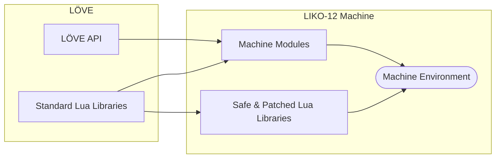

```mermaid
graph LR;
    subgraph LÖVE
        love[LÖVE API]
        std[Standard Lua Libraries]
    end

    subgraph LIKO-12 Machine
        liko[Machine Modules]
        safe-std[Safe & Patched Lua Libraries]

        machine-env([Machine Environment])
    end

    love --> liko
    std --> liko
    std --> safe-std

    liko --> machine-env
    safe-std --> machine-env
```